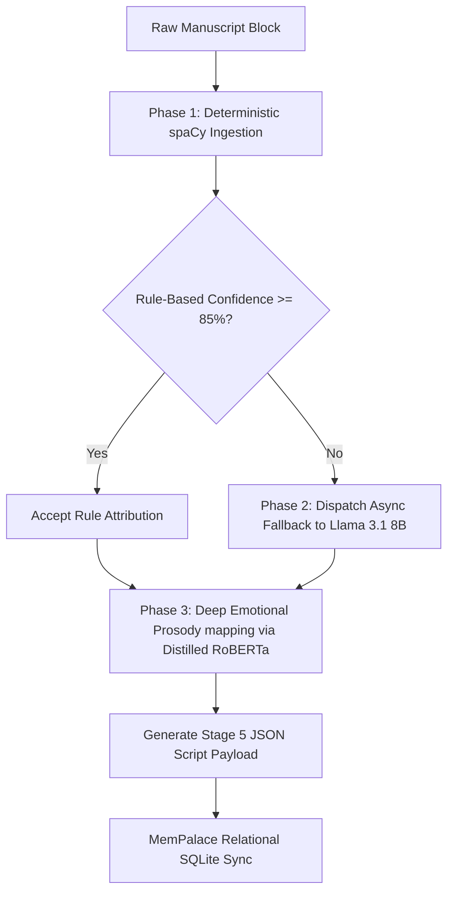
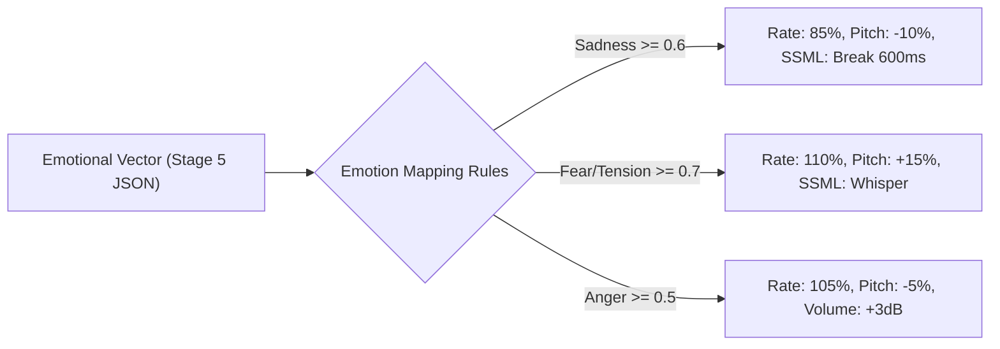

# Volcano Studios: Hybrid NLP Pipeline Design

This document details the architectural specification for the Volcano Studios Hybrid Ingestion & Analysis Pipeline. To optimize processing speeds and compute costs while ensuring high-fidelity outputs, this pipeline integrates standard rule-based NLP (spaCy), a server-hosted Llama 3.1 8B speaker attribution fallback, and a distilled RoBERTa classifier for deep emotional prosody mapping.

---

## 1. Hybrid Pipeline Architecture

The hybrid approach partitions text processing into three computational phases:



---

## 2. Technical Specifications & Components

### Component A: Rule-Based Confidence Scoring (spaCy)
During standard ingestion, spaCy and rule-based heuristics determine the dialogue speaker and assign a deterministic confidence score based on the attribution pathway:

| Attribution Pathway | Confidence | Fallback Triggered? |
| :--- | :---: | :---: |
| **Direct Speech Verb** (Subject-Verb Dependency) | `0.95` | No (Accepted) |
| **Speaker Lock** (2-line active conversational lock) | `0.90` | No (Accepted) |
| **Context Entity Mention** (Character name in paragraph) | `0.70` | **Yes (Triggers LLM)** |
| **Context Alias Mention** (Pronoun or alias reference) | `0.60` | **Yes (Triggers LLM)** |
| **Alternating Queue Fallback** (Conversational toggle) | `0.50` | **Yes (Triggers LLM)** |
| **Default Narration Fallback** | `0.00` | **Yes (Triggers LLM)** |

#### Heuristic Rule Engine Extension:
```python
# In src/nlp_analyzer.py

def analyze_attribution_confidence(line_data: dict) -> float:
    """Assigns a numeric confidence rating to rule-based attributions."""
    method = line_data.get("attribution_method")
    
    # Mapping heuristic routes to confidence ratings
    confidence_map = {
        "Direct Speech Verb (Before)": 0.95,
        "Direct Speech Verb (After)": 0.95,
        "Direct Speech Verb": 0.95,
        "Speaker Lock Override": 0.90,
        "Context Entity Mention": 0.70,
        "Context Alias Mention": 0.60,
        "Auto-Attributed (Alternating)": 0.50,
        "Auto-Attributed (Single Active)": 0.50,
        "Default Narration Fallback": 0.00,
        "Narration": 1.00
    }
    return confidence_map.get(method, 0.0)
```

---

### Component B: The Attribution Fallback (Llama 3.1 8B Server)
When the parser identifies a dialogue line with a confidence score **lower than 0.85**, it halts local processing of that paragraph and dispatches a request to a server-side Llama 3.1 8B instance.

#### LLM Fallback Request Implementation:
```python
import httpx
import logging

logger = logging.getLogger("LlamaFallback")

class HybridAttributionRouter:
    def __init__(self, server_url: str = "http://localhost:8000/v1/chat/completions"):
        self.server_url = server_url
        self.client = httpx.AsyncClient(timeout=10.0)

    async def resolve_speaker_fallback(
        self, 
        paragraph: str, 
        dialogue: str, 
        characters: list, 
        preceding_context: list
    ) -> dict:
        """
        Dispatches dialogue and narrative context to Llama 3.1 8B.
        Returns a dict: {'speaker': str, 'confidence': float}
        """
        # Format 3 lines of conversational history for context tracking
        history_str = "\n".join([
            f"Line {l['line_number']} [{l['character']}]: {l['text']}" 
            for l in preceding_context
        ])
        
        prompt = f"""
You are an expert reading comprehension system. Analyze the paragraph context below and attribute the speaker of the target dialogue.

Available Characters: {characters}

Conversational History:
{history_str}

Paragraph Context:
{paragraph}

Target Dialogue to Attribute:
"{dialogue}"

Return a JSON object containing:
1. "speaker": Select a name from the available character roster, or "Narrator" if spoken by the storyteller.
2. "confidence": A float from 0.0 to 1.0 representing your attribution confidence.

Return ONLY raw valid JSON matching this schema:
{{
  "speaker": "Mr. Heathcliff",
  "confidence": 0.94
}}
"""
        payload = {
            "model": "meta-llama/Meta-Llama-3.1-8B-Instruct",
            "messages": [{"role": "user", "content": prompt}],
            "temperature": 0.1,
            "response_format": {"type": "json_object"}
        }
        
        try:
            response = await self.client.post(self.server_url, json=payload)
            res_json = response.json()
            content = res_json["choices"][0]["message"]["content"]
            return json.loads(content)
        except Exception as e:
            logger.error(f"Llama 3.1 fallback request failed: {e}")
            return {"speaker": "char_unknown_fallback", "confidence": 0.0}
```

---

### Component C: Deep Emotional Prosody (Distilled RoBERTa)
Instead of relying on simple keyword lexicons, text blocks are routed through a distilled multilabel classifier fine-tuned on GoEmotions (e.g. `monologg/bert-base-cased-goemotions-multilabel` or a DistilRoBERTa equivalent). This outputs a multi-dimensional emotional vector representing granular states.

#### GoEmotions Vector Extraction:
```python
# In src/nlp_analyzer.py

HAS_TRANSFORMERS = False
try:
    from transformers import pipeline
    HAS_TRANSFORMERS = True
except ImportError:
    pass

class EmotionalProsodyClassifier:
    def __init__(self, model_name: str = "monologg/bert-base-cased-goemotions-multilabel"):
        self.pipeline = None
        if HAS_TRANSFORMERS:
            # Load multiclass text classifier
            self.pipeline = pipeline(
                "text-classification", 
                model=model_name, 
                return_all_scores=True
            )
            logger.info("Distilled RoBERTa GoEmotions classifier loaded successfully.")
            
    def extract_emotional_vector(self, text: str) -> dict:
        """
        Analyzes text and returns GoEmotions classes with probability score >= 0.1.
        Default output: {'neutral': 1.0}
        """
        if not self.pipeline or not text.strip():
            return {"neutral": 1.0}
            
        try:
            # Perform model inference
            predictions = self.pipeline(text)[0]
            
            # Filter and sort labels with scores >= 0.1
            vector = {}
            for pred in predictions:
                label = pred["label"]
                score = round(float(pred["score"]), 3)
                if score >= 0.1:
                    vector[label] = score
                    
            if not vector:
                # Return highest score if all fall below 0.1
                top_pred = max(predictions, key=lambda x: x["score"])
                vector[top_pred["label"]] = round(float(top_pred["score"]), 3)
                
            return vector
        except Exception as e:
            logger.error(f"Error during emotional prosody prediction: {e}")
            return {"neutral": 1.0}
```

---

## 3. Integrating GoEmotions with Audio Post-Processing

The Audio Engineering Team reads the emotional vector directly from the output JSON and maps it to specific SSML markers and voice modulations in `voice_synthesizer.py` and `audio_mixer.py`:



---

## 4. Modified Stage 5 JSON Output Schema

Lines processed through the hybrid pipeline contain structured attribution pathways and multi-dimensional emotional vectors:

```json
{
    "line_id": "8f3a9e2d1c5b7a8f",
    "chapter": 1,
    "scene": 1,
    "line_number": 12,
    "character": "Heathcliff",
    "speaker_id": "char_heathcliff",
    "segment_type": "dialogue",
    "text": "What are you for? Walk in!",
    "emotion": "Tension",
    "emotional_vector": {
        "anger": 0.685,
        "annoyance": 0.421,
        "tension": 0.712
    },
    "performance": {
        "pitch_modifier": 0.95,
        "speed_modifier": 1.05,
        "delivery_style": "furious_shout"
    },
    "post_padding_ms": 300,
    "attribution_method": "Hybrid Fallback (Llama 3.1 8B)",
    "confidence": 0.92,
    "speaker_locked": true
}
```
