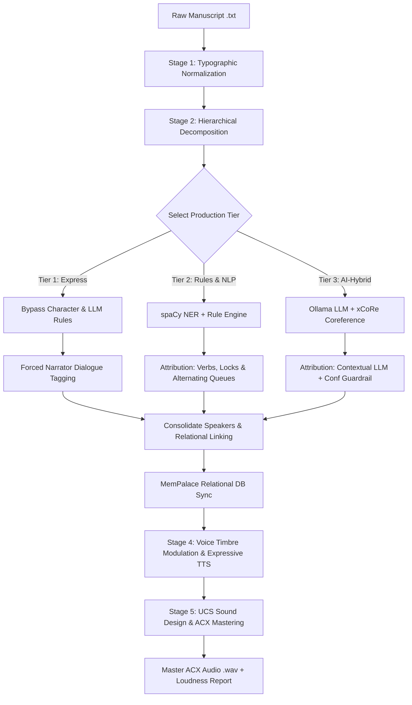

# Volcano Studios: Manuscript-to-Script Ingestion & Tiered Analysis Methodology

This document outlines the architectural flow, processing stages, and tiered parsing engine of Volcano Studios. It describes how raw literary manuscripts are normalized, decomposed into navigation hierarchies, and compiled into performance-ready script schemas. It concludes with a critical analysis of the current approach and proposes a Next-Generation Blueprint to solve current constraints in character detection, speed, and attribution confidence.

---

## 1. Architectural Pipeline & Data Flow

Volcano Studios processes manuscripts through a multi-stage NLP and Relational Database (MemPalace) pipeline. Below is the workflow showing how raw text is ingested, analyzed across the 3 processing tiers, and compiled into the final master audio:



---

## 2. Ingestion Stages

### Stage 1: Typographic Normalization
Raw manuscripts frequently contain smart typography anomalies (curly quotes, dashes, ellipses) and formatting clutter.
* **Curly-to-Straight Normalization**: Standardizes typographic double/single quotes (`“` / `”` $\rightarrow$ `"`, `‘` / `’` $\rightarrow$ `'`) and chevron markers.
* **Clutter Scrubbing**: Automatically detects and strips metadata boilerplate (e.g., Project Gutenberg license blocks, illustrator credits, publisher front-matter).
* **Whitespace Compaction**: Standardizes multiple newlines down to uniform double-carriage returns (`\n\n`) to serve as clean paragraph boundaries.

### Stage 2: Hierarchical Decomposition
The normalized text is recursively parsed into a structured navigation tree to feed GUI navigation components:
1. **Parts/Books**: Split by major section headings (e.g., `Part I`, `Book Two`, `Volume II`).
2. **Chapters**: Segmented via regex matching standard patterns (e.g., `Chapter 1`, `CHAPTER IX`, Gutenberg Roman numeral indices).
3. **Scenes**: Detected by explicit separator marks (e.g., `* * *`, `---`, `#`). If absent, a fallback density heuristic divides chapters into logical scenes every **12 paragraphs**.
4. **Line-Level Transcript**: Chronological extraction of narrative and dialogue units.

### Stage 3: Alternating Segment Quote Extraction
Each paragraph is parsed character-by-character into a stream of alternating `narrative` and `dialogue` segments.
* **The Apostrophe Trap**: Differentiates between dialogic single quotes and contractions/possessives (e.g., `don't` or `McGregor's`) by checking surrounding alphanumeric characters.
* **Terminal Punctuation Lock**: Ensures ending punctuation marks (e.g., `!`, `?`, `.`, `,`) are cleanly grouped inside the dialogue boundaries rather than leaking into narrative tokens.

---

## 3. The 3-Tier Parsing Methodology

Volcano Studios operates three computational tiers to balance processing speed, compute costs, and speaker attribution accuracy.

### Tier 1: Express Narrator (Deterministic Bypass)
* **Objective**: Rapid, zero-cost processing for single-narrator formats.
* **Heuristic**: Bypasses all character extraction, database checks, and LLM processing. All dialogue segments are automatically assigned to the `Narrator` with the attribution method `Tier 1 Default`.
* **Compute Footprint**: Instantaneous, running entirely on rule-based CPU pipelines.

### Tier 2: Rules & Heuristics NLP (Semi-Automated)
* **Objective**: Structured, medium-fidelity script generation without relying on generative LLMs.
* **Character Roster Building**: Extracts character entities using spaCy's Named Entity Recognition (`PERSON` tags) or regex heuristics on the first 100,000 characters.
* **Consolidation Engine**: Merges duplicates using string similarity (e.g., `SequenceMatcher` ratio $\ge 0.8$) and substring mapping, guarding against merging matching titles with different honorifics (e.g., preventing `Mr. McGregor` from merging with `Mrs. McGregor`).
* **Dialogue Attribution Rules**:
  1. **Direct Speech Verbs**: Checks narrative text immediately preceding or following the quote block for character names paired with a predefined set of speech verbs (e.g., *said*, *whispered*, *replied*).
  2. **Preceding Speaker Lock**: If a character spoke with high confidence, locks them as the speaker for up to **2 subsequent alternating lines** to handle back-and-forth dialogue.
  3. **Context Alias Mentions**: Resolves pronouns and contextual names (e.g., mapping `mother` to `Mrs. Rabbit` inside Peter Rabbit).
  4. **Alternating Queue Fallback**: Alternates between the two most recently active speakers in the dialogue queue.
* **Sentiment Analysis**: Maps discrete emotions (`Joy`, `Sadness`, `Tension`, `Neutral`) using NLTK VADER or keyword matching.

### Tier 3: AI-Hybrid (Ollama & Coreference Assisted)
* **Objective**: High-fidelity character tracking and human-like delivery style attribution.
* **Local LLM Extraction**: Queries a local Ollama instance (typically running `qwen2.5-coder:3b` at low temperature) to extract the canonical character roster from the first 15,000 characters.
* **Coreference Resolution**: Employs the `xCoRe` Litbank model on GPU to cluster pronoun mentions to their canonical proper characters.
* **Ollama-Guided Attribution**: For dialogue lines that fail simple direct speech verb rules, passes the context paragraph to Ollama to determine:
  * The target speaker (matched back to the canonical roster).
  * The spoken emotion (`Joy`, `Sadness`, `Tension`, `Neutral`).
  * The granular delivery style / tone (e.g., `maternal_caution`, `furious_shout`).
  * An attribution confidence score (float `0.0` to `1.0`).
* **Confidence Guardrail**: If the local LLM returns a confidence score **lower than 75% (0.75)**, the system flags the line as `char_unknown_fallback` to prevent incorrect voice synthesis.

---

## 4. Critique of the Current Approach

While functional, the current implementation has several architectural bottlenecks:

| Feature | Current Implementation | Limitation / Fragility |
| :--- | :--- | :--- |
| **Character Extraction** | Samples only the first 15,000 characters in Tier 3. | Characters introduced mid-book or in later chapters are completely missed. |
| **LLM Inference Overhead** | Queries Ollama paragraph-by-paragraph. | High network/process latency; misses scene-wide conversational context, and can cause Ollama to crash or time out. |
| **Rule-Based Attribution** | Relies on hardcoded lists of `SPEECH_VERBS` and keyword regex. | Fails on complex literary structures (e.g., inverted structures, passive voice, or non-standard verbs like *sighed*). |
| **Low-Confidence Handler** | Drops low-confidence (<75%) attributions to `char_unknown_fallback`. | Triggers synthetic defaults instead of utilizing editor inputs, creating repetitive editing tasks. |
| **Memory Portability** | Relational overrides (`confirmed_merges`) are loaded but not fed back to update heuristics. | Heuristics do not adapt to manual corrections across chapters. |

---

## 5. Next-Generation Blueprint: Proposed Improvements

To transition the parser from a heuristic system to a production-grade ingestion suite, we propose the following improvements:

### A. Sliding-Window/Multi-Pass Character Extraction
Instead of scanning only the first 15k characters, implement a two-pass extraction framework:
1. **Pass 1 (Lexical Scan)**: Run a rapid spaCy NER or regex scan over the entire manuscript to build a list of candidate names.
2. **Pass 2 (LLM Validation)**: Feed the candidate lists in chunks to Ollama to filter out false positives (e.g., place names, capitalized sentence starters) and map aliases to canonical identities.

### B. Scene-Level Contextual Batching
Instead of calling the local LLM once for every single paragraph, batch dialogue segments by scene:
* **Context Payload**: Send the entire scene structure (10-20 dialogue lines with surrounding narrative context) in a single structured XML/JSON prompt.
* **Benefits**: Reduces LLM invocation calls by **80-90%**, significantly decreasing processing time while giving the model full conversational context to accurately attribute alternating lines.

### C. Syntactic Dependency Parsing (spaCy Trees)
Upgrade Tier 2 rules to inspect the syntactic dependency tree rather than relying on proximity regex:
* Instead of checking if a name is near a speech verb, search for the **subject** (`nsubj` or `nsubjpass`) of the speech verb node in the dependency tree. This resolves complex grammatical structures like:
  * *"I don't think so," Watson, looking out the rain-soaked window, quietly sighed.*

### D. Progressive Relational Learning (MemPalace Feedback Loop)
Make the ingestion engine adaptive by integrating the parser with `confirmed_merges` and `rooms` tables in MemPalace:
* If an editor manually links `Watson` to `John Watson` in Chapter 1, this mapping is saved in SQLite and automatically loaded as a high-priority alias for Chapter 2, eliminating repetitive manual edits.

---

## 6. Output Metadata Schemas

The ingestion pipeline produces three structured JSON schemas.

### Schema 1: Manuscript Profile (`manuscript_profile_summary.json`)
Tracks overall book dimensions, narration style, and estimated audiobook durations:

```json
{
    "file_metadata": {
        "filename": "TheTaleofPeterRabbit.txt",
        "file_size_bytes": 12842,
        "word_count": 950,
        "char_count": 5200,
        "estimated_spoken_duration_min": 6.3,
        "processing_tier": "Micro-Tier",
        "narration_pov": "Third-Person"
    },
    "structure_metadata": {
        "total_chapters": 1,
        "total_paragraphs": 45,
        "total_dialogue_lines_extracted": 12,
        "narration_word_ratio_percent": 82.4,
        "dialogue_word_ratio_percent": 17.6
    },
    "character_dialogue_breakdown": {
        "Narrator": {
            "dialogue_line_count": 0,
            "spoken_words": 0,
            "dialogue_share_percent": 0.0,
            "word_share_percent": 82.4
        },
        "Peter Rabbit": {
            "dialogue_line_count": 4,
            "spoken_words": 42,
            "dialogue_share_percent": 33.3,
            "word_share_percent": 4.4
        }
    },
    "emotional_breakdown": {
        "Neutral": 65.0,
        "Joy": 15.0,
        "Sadness": 5.0,
        "Tension": 15.0
    },
    "attribution_summary": {
        "Direct Speech Verb": 5,
        "Speaker Lock Override": 3,
        "Local LLM (Ollama)": 4
    }
}
```

### Schema 2: Hierarchical Index (`hierarchical_script_index.json`)
Constructs the nested structural index used for GUI project navigation:

```json
{
    "metadata": {
        "source_file": "time_machine.txt",
        "quote_style_detected": "double",
        "total_parts": 1,
        "total_chapters": 1,
        "total_scenes": 2,
        "global_characters": [
            "Time Traveller",
            "Psychologist"
        ],
        "merge_decisions": []
    },
    "parts": [
        {
            "part_id": "part_p1",
            "part_title": "Part 1",
            "total_chapters": 1,
            "chapters": [
                {
                    "chapter_id": "chapter_p1_c1",
                    "chapter_number": 1,
                    "chapter_title": "Chapter 1: The Four Dimensions",
                    "total_scenes": 1,
                    "scenes": [
                        {
                            "scene_id": "scene_p1_c1_s1",
                            "scene_number": 1,
                            "characters_present": [
                                "Time Traveller"
                            ],
                            "total_dialogue_lines": 2,
                            "metrics": {
                                "total_words": 150,
                                "narration_words": 120,
                                "dialogue_words": 30
                            },
                            "lines": []
                        }
                    ]
                }
            ]
        }
    ]
}
```

### Schema 3: Studio Script Schema (`scene_script.json`)
The final, performance-ready script containing emotional cues, timing, and TTS voice parameters:

```json
{
    "line_id": "e4a2d8b1f5c6a7e8",
    "chapter": 1,
    "scene": 1,
    "line_number": 3,
    "character": "Sherlock Holmes",
    "speaker_id": "char_sherlock_holmes",
    "segment_type": "dialogue",
    "text": "Do you see anything, Watson?",
    "dialogue": "Do you see anything, Watson?",
    "narration_before": "",
    "narration_after": "",
    "emotion": "Tension",
    "performance": {
        "pitch_modifier": 1.5,
        "speed_modifier": 1.05,
        "delivery_style": "anxious_whisper"
    },
    "post_padding_ms": 400,
    "attribution_method": "Local LLM (Ollama)",
    "confidence": 0.94,
    "speaker_locked": true
}
```

---

> [!NOTE]
> All parameters mapped in `performance` (`pitch_modifier`, `speed_modifier`) are automatically retrieved from the `drawers` table in the MemPalace database to ensure voice consistency.
