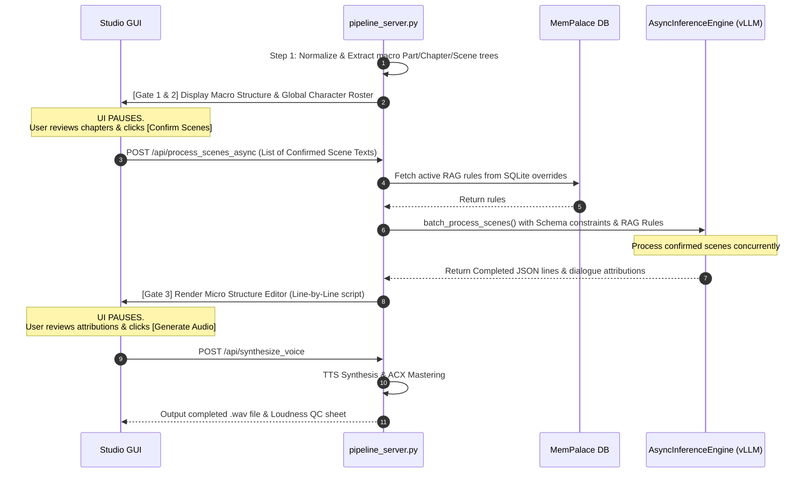

# Firespeaker Studio: Modernized LLM Ingestion Implementation Plan

This plan details the implementation strategy for modernizing the Firespeaker Studio manuscript ingestion pipeline. By leveraging modern local instruction-tuned LLMs with large context windows, native structured output support, high-throughput engines, and RAG-driven memory injection, we can replace fragile rules-based pipelines (Tier 2) and paragraph-by-paragraph processing loops with a faster, more accurate batched system.

---

## 1. System Architecture & Comparison

Below is the comparative flow between the current parser architecture and the proposed modernized LLM engine:

```mermaid
graph TD
    subgraph Current Pipeline (Iterative & Heuristic)
        A1[Raw Manuscript] --> B1[First 15k Characters Only]
        B1 --> C1[Ollama 3B Character Extraction]
        A1 --> D1[Segment Chapter / Paragraphs]
        D1 --> E1[Loop over Paragraphs]
        E1 --> F1{Rule Check: Verbs, Locks}
        F1 -- Low Conf / Failed --> G1[Sync Call Ollama per Paragraph]
        F1 -- Passed --> H1[Rule Attribution]
        G1 & H1 --> I1[Sync to SQLite]
    end

    subgraph Modernized Pipeline (Batched & Struct-Enforced)
        A2[Raw Manuscript] --> B2[Whole Book Ingestion / 128k context]
        B2 --> C2[Llama-3/Gemma-2 Global Profile & Alias Map]
        A2 --> D2[Chapter/Scene Segmentation]
        D2 --> E2[Assemble Scene-Level Context Payload]
        E2 --> F2[Inject MemPalace RAG Decisions & Rules]
        F2 --> G2[Async Concurrent Batching: vLLM / llama.cpp]
        G2 --> H2[Constrained JSON Generation / Schema Enforcement]
        H2 --> I2[Parallel Write to SQLite via Async Loop]
    end
```

---

## 2. Component Design & Implementation Code

### Component A: Whole-Book Global Profiler & Character Extractor
**Concept**: Ingest the entire text in a single inference pass using models with large native context windows (128k tokens). This detects characters introduced at any point in the narrative and extracts their alias profiles in one call.

Implement this method in `src/nlp_analyzer.py`:

```python
def extract_global_profile_large_context(self, full_text: str, model_name: str = "gemma2:9b-instruct-q8_0") -> dict:
    """
    Ingests the entire manuscript text to build a complete character roster, 
    detect aliases, and summarize narrative structures in a single structured pass.
    """
    logger.info(f"Extracting global book profile using {model_name} over full context...")
    
    prompt = f"""
You are an expert literary analysis system. Analyze the entire book manuscript provided below.
Identify every proper character/speaker and output:
1. The canonical proper name (e.g., "Old Mrs. Rabbit" instead of "Mrs. Rabbit" or "mother").
2. A list of all names, pronouns, or descriptors used to refer to them (e.g., ["Mrs. Rabbit", "mother", "she"]).
3. Their character archetype/role.
4. The narrative POV (e.g., "First-Person" or "Third-Person").

MANUSCRIPT TEXT:
{full_text}

Return the results in a valid JSON object matching the following structure:
{{
  "metadata": {{
    "narration_pov": "Third-Person",
    "genre_notes": "Children's Literature"
  }},
  "characters": [
    {{
      "canonical_name": "Old Mrs. Rabbit",
      "aliases": ["Mrs. Rabbit", "mother", "she"],
      "role": "Parent/Guardian"
    }},
    {{
      "canonical_name": "Peter Rabbit",
      "aliases": ["Peter", "he", "him", "little rabbit"],
      "role": "Protagonist"
    }}
  ]
}}
Return ONLY the raw valid JSON. Do not include markdown code block formatting.
"""
    # Use Ollama's native JSON mode
    import urllib.request
    import json
    
    payload = {
        "model": model_name,
        "prompt": prompt,
        "format": "json",
        "stream": False,
        "options": {
            "temperature": 0.1,
            "num_ctx": 131072  # 128k Context Window
        }
    }
    
    try:
        data = json.dumps(payload).encode("utf-8")
        req = urllib.request.Request(
            "http://localhost:11434/api/generate",
            data=data,
            headers={"Content-Type": "application/json"}
        )
        # Extend timeout for large context processing
        res = urllib.request.urlopen(req, timeout=300.0)
        if res.status == 200:
            response_obj = json.loads(res.read().decode("utf-8"))
            return json.loads(response_obj.get("response", "{}"))
    except Exception as e:
        logger.error(f"Failed whole-book extraction: {e}")
        return {}
```

---

### Component B: Constrained JSON Scene-Level Batch Parser
**Concept**: Replaces paragraph-by-paragraph queries. It passes an entire scene containing sequential lines to the LLM and enforces a JSON Schema output. The model returns the aligned script, dialogue attributions, and emotional metadata.

Implement this in `src/hierarchical_parser.py`:

```python
def parse_scene_batched_structured(self, scene_text: str, global_characters: list, editor_rules: list) -> list:
    """
    Parses a full scene block, attributes speakers, and assigns emotion/delivery styles 
    in a single constrained JSON schema generation pass.
    """
    characters_str = ", ".join(global_characters)
    rules_str = "\n".join([f"- {r}" for r in editor_rules]) if editor_rules else "- None"
    
    prompt = f"""
You are a theatrical script compiler. Standardize the following scene text.
Segment the text into consecutive narrative and dialogue blocks, keeping their exact chronological sequence.
Attribute dialogue lines to the correct character from the available roster.

Available Characters: [{characters_str}]

Editor Memory Rules:
{rules_str}

For each line, determine:
1. The character (e.g. proper character name or "Narrator").
2. The segment_type ("dialogue" or "narrative").
3. The emotion ("Joy", "Sadness", "Tension", "Neutral").
4. A performance delivery style (e.g., "anxious_whisper", "authoritative", "excited", "descriptive", "maternal_caution").
5. Your attribution confidence score (float 0.0 to 1.0).

SCENE TEXT:
{scene_text}

Return a JSON object containing a "lines" key with an array of objects matching this exact schema:
{{
  "lines": [
    {{
      "segment_type": "narrative",
      "text": "The Time Traveller stood in the laboratory.",
      "character": "Narrator",
      "emotion": "Neutral",
      "delivery_style": "descriptive",
      "confidence": 1.0
    }},
    {{
      "segment_type": "dialogue",
      "text": "You must follow me carefully,",
      "character": "Time Traveller",
      "emotion": "Neutral",
      "delivery_style": "authoritative",
      "confidence": 0.95
    }}
  ]
}}
Return ONLY valid JSON matching this schema.
"""
    # Define JSON schema structure for Ollama / vLLM schema constraint matching
    # Ensures the engine strictly returns our target JSON structure
    schema_constraint = {
        "type": "object",
        "properties": {
            "lines": {
                "type": "array",
                "items": {
                    "type": "object",
                    "properties": {
                        "segment_type": {"type": "string", "enum": ["dialogue", "narrative"]},
                        "text": {"type": "string"},
                        "character": {"type": "string"},
                        "emotion": {"type": "string", "enum": ["Joy", "Sadness", "Tension", "Neutral"]},
                        "delivery_style": {"type": "string"},
                        "confidence": {"type": "number"}
                    },
                    "required": ["segment_type", "text", "character", "emotion", "delivery_style", "confidence"]
                }
            }
        },
        "required": ["lines"]
    }
    
    # Configure Ollama/vLLM payload with format schema constraint
    payload = {
        "model": "llama3:8b-instruct-q8_0",
        "prompt": prompt,
        "format": schema_constraint,
        "stream": False,
        "options": {
            "temperature": 0.1
        }
    }
    
    # API request transmission (HTTP client code omitted for brevity...)
    # returns structured array of lines cleanly
```

---

### Component C: Asynchronous High-Throughput Engine Wrapper
**Concept**: Replaces standard synchronous connections with an asynchronous engine supporting **vLLM** or **llama.cpp**'s continuous concurrent batching, enabling multiple scenes to be parsed in parallel.

Create `src/async_inference.py` to manage concurrent parsing:

```python
import asyncio
import httpx
import logging
import json

logger = logging.getLogger("AsyncInference")

class AsyncInferenceEngine:
    def __init__(self, backend: str = "vllm", base_url: str = "http://localhost:8000"):
        self.backend = backend.lower()
        self.base_url = base_url
        self.client = httpx.AsyncClient(timeout=180.0)

    async def generate_completion(self, prompt: str, schema: dict = None) -> str:
        """Dispatches an async API request to vLLM or llama.cpp endpoint."""
        if self.backend == "vllm":
            # vLLM OpenAI-compatible JSON schema format
            payload = {
                "model": "meta-llama/Meta-Llama-3-8B-Instruct",
                "messages": [{"role": "user", "content": prompt}],
                "temperature": 0.1,
                "response_format": {"type": "json_object", "schema": schema} if schema else {"type": "json_object"}
            }
            url = f"{self.base_url}/v1/chat/completions"
            response = await self.client.post(url, json=payload)
            res_json = response.json()
            return res_json["choices"][0]["message"]["content"]
            
        elif self.backend == "llamacpp":
            # llama.cpp server grammar / schema endpoint configuration
            payload = {
                "prompt": prompt,
                "temperature": 0.1,
                "json_schema": schema if schema else {}
            }
            url = f"{self.base_url}/completion"
            response = await self.client.post(url, json=payload)
            return response.json()["content"]
            
        else:
            raise ValueError(f"Unsupported async backend: {self.backend}")

    async def close(self):
        await self.client.aclose()
```

---

### Component D: RAG-Driven Relational Learning (MemPalace Integration)
**Concept**: Instead of writing hardcoded rules in Python to parse pronoun locks, pull previous editor corrections from the `confirmed_merges` and `drawers` SQLite database tables and inject them directly into the LLM system prompt as active context rules.

Add these helper methods in `src/spatial_memory.py` to retrieve active rules dynamically:

```python
def fetch_active_rag_context_rules(self, book_filename: str) -> list:
    """
    Queries MemPalace to extract confirmed merges, splits, and alias overrides 
    to format them as prompt rules for the LLM pipeline.
    """
    cursor = self.conn.cursor()
    # Retrieve confirmed character consolidation decisions
    cursor.execute("""
        SELECT original_name, canonical_name, is_confirmed 
        FROM confirmed_merges 
        WHERE book_filename = ?;
    """, (book_filename,))
    
    rules = []
    for orig, canon, is_confirmed in cursor.fetchall():
        if is_confirmed == 1:
            rules.append(f"Character alias correction: Treat '{orig}' as '{canon}'.")
        else:
            rules.append(f"Separation override: Do NOT merge '{orig}' with '{canon}'. Keep them as separate speakers.")
            
    # Retrieve pre-registered characters and their speed configurations to flag narrator roles
    cursor.execute("SELECT character_name FROM drawers;")
    drawers = [row[0] for row in cursor.fetchall()]
    if drawers:
        rules.append(f"Active registered character voices: {drawers}.")
        
    return rules
```

---

## 3. Human-in-the-Loop (HITL) Verification Gates & Async Flow Mapping

To prevent batch operations from running ahead of editor approvals, the compilation flow is divided into structural verification checkpoints. Rather than parsing the entire manuscript in a single pass, the pipeline is segmented into confirmed blocks:



### Route Handler Integration Example:
```python
# Inside src/gui_server.py

async def handle_post_process_scenes_async(self, confirmed_scenes: list, book_id: str, global_roster: list):
    """
    Webserver endpoint trigger for confirmed batch processing.
    Executes scene analysis for confirmed scenes only, using the async engine.
    """
    # 1. Fetch relational overrides
    active_rules = self.palace.fetch_active_rag_context_rules(book_id)
    
    # 2. Trigger concurrent parsing on the engine
    results = await batch_process_scenes(
        scenes=confirmed_scenes,
        characters=global_roster,
        engine=self.vllm_engine,
        rules=active_rules
    )
    
    # 3. Synchronize structured output to Relational SQLite tables
    for res in results:
        if res["status"] == "success":
            self.palace.write_scene_lines(res["scene_id"], res["data"]["lines"])
        else:
            self.palace.flag_scene_failed(res["scene_id"], res["error"])
```

---

## 4. Async Exception Handling & Retry Strategy

Continuous batching engines processing literary text might experience connection dropouts, token limit overflows, or localized failures. To prevent a single scene failure from crashing the entire batch transaction, tasks are wrapped in a robust, timeout-guarded exception handler:

```python
async def process_single_scene_safe(
    scene_text: str, 
    scene_id: str, 
    prompt: str, 
    schema: dict, 
    engine: AsyncInferenceEngine
) -> dict:
    """
    Wraps single scene generation in an isolated try/except block 
    with a Timeout guard to prevent batch blocks.
    """
    try:
        # Prevent hangs on long literary descriptions with a 60-second execution gate
        response = await asyncio.wait_for(
            engine.generate_completion(prompt, schema), 
            timeout=60.0
        )
        parsed_data = json.loads(response)
        return {
            "scene_id": scene_id,
            "status": "success",
            "data": parsed_data
        }
    except asyncio.TimeoutError:
        logger.error(f"Scene {scene_id} processing timed out after 60 seconds.")
        return {
            "scene_id": scene_id,
            "status": "failed_retry_required",
            "error": "TimeoutError: Model took too long to compile structured response."
        }
    except json.JSONDecodeError as jde:
        logger.error(f"JSON validation failed for Scene {scene_id}: {jde}")
        return {
            "scene_id": scene_id,
            "status": "failed_retry_required",
            "error": f"JSONDecodeError: Model response failed structural schema constraints. {jde}"
        }
    except Exception as e:
        logger.error(f"Fatal error processing Scene {scene_id}: {e}")
        return {
            "scene_id": scene_id,
            "status": "failed_retry_required",
            "error": f"Exception: {str(e)}"
        }

async def batch_process_scenes(
    scenes: list, 
    characters: list, 
    engine: AsyncInferenceEngine,
    rules: list
) -> list:
    """
    Executes parallel scene parsing concurrently. 
    Maintains completion state even if individual scenes fail.
    """
    tasks = []
    for scene in scenes:
        scene_text = scene["raw_scene_text"]
        scene_id = scene["scene_id"]
        
        # Compile prompt and schema constraint objects
        prompt = self.compile_scene_prompt(scene_text, characters, rules)
        schema = self.get_scene_json_schema()
        
        # Dispatch isolated tasks
        tasks.append(process_single_scene_safe(scene_text, scene_id, prompt, schema, engine))
        
    logger.info(f"Dispatching {len(tasks)} parallel script compilation pipelines...")
    results = await asyncio.gather(*tasks)
    return results
```

---

## 5. Recommended Model Benchmarks

To optimize narrative consistency and delivery-style accuracy, we recommend instruction-tuned models optimized for 8k+ context tasks over coder models:

| Model | Size | Strengths | Recommended Platform |
| :--- | :--- | :--- | :--- |
| **Llama-3-8B-Instruct** | 8 Billion | Fast inference, robust logical reasoning, clean JSON formatting. | llama.cpp (GGUF Q8) or vLLM |
| **Gemma-2-9B-It** | 9 Billion | Superior emotional categorization, excellent nuance parsing. | vLLM (FP16/AWQ) |
| **Mistral-Nemo-12B-Instruct** | 12 Billion | Native 128k context, strong multi-turn narrative structure. | vLLM or llama.cpp |

---

## 6. Steps to Integrate into Firespeaker

1. **Initialize the Async Wrapper**: Integrate the `AsyncInferenceEngine` into the initialization block of `FirespeakerPipeline` (`main.py`).
2. **Refactor Ingestion Loop**: Modify `run_full_pipeline` in `main.py` to segment the entire manuscript into scenes first, and then run `batch_process_scenes` using `asyncio.run()`.
3. **Inject RAG Prompts**: In `hierarchical_parser.py`, replace the rule checks (`Direct Speech Verb`, `Speaker Lock`, `Alternating Queue`) by calling `fetch_active_rag_context_rules` from `MemPalace` and appending the rules to the scene prompt.
4. **Enforce Constraints**: Configure the connection payload format to enforce the JSON Schema. This allows the parser to directly load the model response as a Python dictionary (`json.loads(response)`), completely eliminating regex validation steps.
5. **Switch Model**: Update `requirements.txt` or Docker files to deploy the vLLM engine, and set the default model parameter in configurations to `llama3:8b-instruct-q8_0` or `gemma2:9b-instruct`.

---

## 7. Pydantic Verification Schema (models.py)

To guard the downstream voice synthesis pipelines (e.g. `main.py` and `voice_synthesizer.py`) against keys missing due to model output drift or structural variations in Tier 1 outputs, enforce a Pydantic validation schema. This will automatically inject default emotional, delivery, and padding values if they are omitted by simpler parsing runs:

```python
from pydantic import BaseModel, Field
from typing import Literal, Optional

class PerformanceMetrics(BaseModel):
    pitch_modifier: float = Field(default=1.0)
    speed_modifier: float = Field(default=1.0)
    delivery_style: str = Field(default="neutral_narrative")

class ScriptLine(BaseModel):
    line_id: str
    chapter: int
    scene: int
    line_number: int
    character: str
    speaker_id: str
    segment_type: Literal["dialogue", "narrative"]
    text: str
    
    # These fields will auto-populate with defaults if missing in Tier 1 / raw structures
    emotion: str = Field(default="Neutral")
    performance: PerformanceMetrics = Field(default_factory=PerformanceMetrics)
    post_padding_ms: int = Field(default=250)
    
    attribution_method: str
    confidence: float
    speaker_locked: bool

class ScenePayload(BaseModel):
    scene_id: str
    lines: list[ScriptLine]
```

