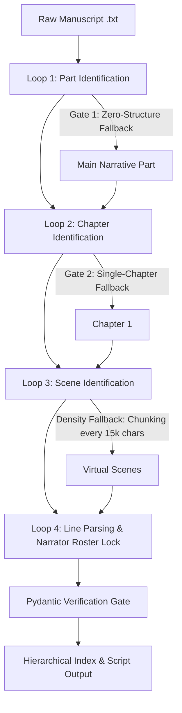

# Firespeaker Studio: Tier 1 Cascading Loops Pipeline Design

This document details the software design for the Tier 1 deterministic cascading loops pipeline in Firespeaker Studio. Operating completely offline and on CPU, this pipeline processes raw text manuscripts into hierarchical script transcripts. By utilizing a 4-loop structured workflow, the engine systematically parses Parts, Chapters, Scenes, and Lines using robust regex patterns, character-by-character quote extraction, and Pydantic schema validation.

---

## 1. Cascading Loops Process Flow

The pipeline executes as a sequence of deterministic steps, passing text blocks downward and accumulating structural metadata at each level:



---

## 2. Implementation Specifications

### Loop 1: Part Identification (Macro-Router)
* **Goal**: Segment the raw manuscript text into major book divisions (e.g. Parts, Books, Volumes) and handle unformatted books.
* **Regex Pattern**: `r'^(?:PART|BOOK|VOLUME)\s+(?:[0-9]+|[IVXLCDM]+|one|two|three|four|five)\b.*$'` (case-insensitive, multi-line).
* **Gate 1 (Zero-Structure Fallback)**: If no matching part dividers are found, wrap the entire manuscript in a single "Main Narrative" part object.

```python
import re
from typing import Dict, List

def identify_parts(raw_text: str) -> List[Dict[str, str]]:
    """
    Splits the raw text by major book divisions.
    Returns a list of dicts: [{'part_id': str, 'title': str, 'text_block': str}]
    """
    part_pattern = re.compile(
        r'^(?:PART|BOOK|VOLUME)\s+(?:[0-9]+|[IVXLCDM]+|one|two|three|four|five|six|seven|eight|nine|ten)\b.*$',
        re.IGNORECASE | re.MULTILINE
    )
    
    # Extract matches and split content
    headings = [m.strip() for m in part_pattern.findall(raw_text)]
    splits = part_pattern.split(raw_text)
    
    # Handle preface/introduction text before the first formal Part header
    preface_block = splits[0].strip()
    parts = []
    
    if len(splits) <= 1:
        # Gate 1 Triggered: Fall back to zero-structure container
        return [{
            "part_id": "part_p1",
            "title": "Main Narrative",
            "text_block": raw_text.strip()
        }]
        
    if preface_block and len(preface_block) > 100:
        parts.append({
            "part_id": "part_p0",
            "title": "Preface/Introduction",
            "text_block": preface_block
        })
        
    for idx, heading in enumerate(headings):
        text_chunk = splits[idx + 1].strip() if idx + 1 < len(splits) else ""
        parts.append({
            "part_id": f"part_p{len(parts) + 1}",
            "title": heading,
            "text_block": text_chunk
        })
        
    return parts
```

---

### Loop 2: Chapter Identification (Meso-Router)
* **Goal**: Subdivide a Part's text block into distinct chapters.
* **Regex Pattern**: `r'(?i)^\s*(?:(?:chapter|scene)\s+(?:[0-9]+|[IVXLCDM]+|one|two|three|four|five)\b|(?:[IVXLCDM]+)(?:--|\s*[-.]\s*).*)$'` (multi-line).
* **Gate 2 (Single-Chapter Fallback)**: If no chapter dividers are found, default the entire text block to Chapter 1.

```python
def identify_chapters(part_text: str, part_id: str) -> List[Dict[str, str]]:
    """
    Splits a Part text block into individual chapters.
    Returns a list of dicts: [{'chapter_id': str, 'title': str, 'text_block': str}]
    """
    chapter_pattern = re.compile(
        r'(?i)^\s*(?:(?:chapter|scene)\s+(?:[0-9]+|[IVXLCDM]+|one|two|three|four|five|six|seven|eight|nine|ten)\b|(?:[IVXLCDM]+)(?:--|\s*[-.]\s*).*)$',
        re.MULTILINE
    )
    
    headings = [m.strip() for m in chapter_pattern.findall(part_text)]
    splits = chapter_pattern.split(part_text)
    
    preface_block = splits[0].strip()
    chapters = []
    
    if len(splits) <= 1:
        # Gate 2 Triggered: Fall back to single chapter container
        return [{
            "chapter_id": f"{part_id}_c1",
            "title": "Chapter 1",
            "text_block": part_text.strip()
        }]
        
    if preface_block and len(preface_block) > 100:
        chapters.append({
            "chapter_id": f"{part_id}_c0",
            "title": "Prologue/Introduction",
            "text_block": preface_block
        })
        
    for idx, heading in enumerate(headings):
        text_chunk = splits[idx + 1].strip() if idx + 1 < len(splits) else ""
        chapters.append({
            "chapter_id": f"{part_id}_c{len(chapters) + 1}",
            "title": heading,
            "text_block": text_chunk
        })
        
    return chapters
```

---

### Loop 3: Scene Identification (Micro-Router)
* **Goal**: Partition a chapter into manageable segments (scenes) to prevent TTS synthesis memory bloat during audio generation.
* **Scene Breaks**: Matches common markers like `* * *`, `---`, `#`.
* **Density Heuristic (Fallback)**: If no breaks exist, automatically segment the text every **15,000 characters** (approx. 2,500 words) on double newlines (`\n\n`) to preserve paragraph boundaries.

```python
def identify_scenes(chapter_text: str, chapter_id: str, max_chars: int = 15000) -> List[Dict[str, str]]:
    """
    Segments chapter text into scenes using explicit markers or a paragraph density fallback.
    Returns a list of dicts: [{'scene_id': str, 'text_block': str}]
    """
    scene_separator = r'(?:\r?\n)\s*(?:\*\s*\*|\#|-{3,}|_{3,})\s*(?:\r?\n)'
    splits = [s.strip() for s in re.split(scene_separator, chapter_text) if s.strip()]
    
    if len(splits) > 1:
        return [
            {"scene_id": f"{chapter_id}_s{i + 1}", "text_block": block} 
            for i, block in enumerate(splits)
        ]
        
    # Fallback: Density Heuristic (Split by paragraph chunks near max_chars limit)
    paragraphs = [p.strip() for p in re.split(r'\r?\n\s*\r?\n', chapter_text) if p.strip()]
    scenes = []
    current_chunk = []
    current_length = 0
    
    for p in paragraphs:
        current_chunk.append(p)
        current_length += len(p) + 2  # account for double newline joiner
        
        if current_length >= max_chars:
            scenes.append("\n\n".join(current_chunk))
            current_chunk = []
            current_length = 0
            
    if current_chunk:
        scenes.append("\n\n".join(current_chunk))
        
    return [
        {"scene_id": f"{chapter_id}_s{i + 1}", "text_block": block}
        for i, block in enumerate(scenes)
    ]
```

---

### Loop 4: Line Ingestion & Narrator Attribution (The Handoff)
* **Goal**: Extract alternating narrative/dialogue segments, apply the "Apostrophe Trap" check, assign everything to the Narrator, and format through Pydantic.
* **Character Roster Lock**: The roster is hardcoded to `["Narrator"]` for Tier 1.
* **Line Generation**: All lines are assigned `speaker_id: "char_narrator"`.

```python
import hashlib
from models import ScriptLine  # import Pydantic models from models.py

def extract_segments(paragraph: str) -> List[Dict[str, Any]]:
    """
    Splits a single paragraph into alternating blocks of narrative and dialogue.
    Handles the apostrophe trap (differentiating dialogue quotes from contractions).
    """
    segments = []
    if not paragraph.strip():
        return segments

    current_buffer = []
    in_quote = False
    quote_delimiter = "'" if "'" in paragraph else '"'

    for idx, char in enumerate(paragraph):
        is_quote = False
        if char == quote_delimiter:
            if char == "'":
                # Check characters on both sides of the apostrophe
                prev_char = paragraph[idx - 1] if idx > 0 else ' '
                next_char = paragraph[idx + 1] if idx + 1 < len(paragraph) else ' '
                if prev_char.isalpha() and next_char.isalpha():
                    is_quote = False  # Contraction (e.g. don't)
                else:
                    is_quote = True   # Speech tag
            else:
                is_quote = True       # Standard double quote
                
        if is_quote:
            text_chunk = "".join(current_buffer).strip()
            if text_chunk:
                segments.append({"type": "dialogue" if in_quote else "narrative", "text": text_chunk})
            current_buffer = []
            in_quote = not in_quote
        else:
            current_buffer.append(char)

    text_chunk = "".join(current_buffer).strip()
    if text_chunk:
        segments.append({"type": "dialogue" if in_quote else "narrative", "text": text_chunk})
        
    # Clean up empty boundaries while preserving vital punctuation marks
    cleaned_segments = []
    for seg in segments:
        clean_text = re.sub(r'^[\s\-]+', '', seg["text"])
        clean_text = re.sub(r'[\s\-]+$', '', clean_text)
        if clean_text:
            cleaned_segments.append({"type": seg["type"], "text": clean_text})
            
    return cleaned_segments

def parse_tier_1_lines(scene_text: str, part_num: int, chapter_num: int, scene_num: int) -> List[ScriptLine]:
    """
    Iterates over paragraphs, segments them, and instantiates Pydantic ScriptLine instances.
    """
    paragraphs = [p.strip() for p in re.split(r'\n+', scene_text) if p.strip()]
    script_lines = []
    line_counter = 1
    
    for p in paragraphs:
        segments = extract_segments(p)
        for segment in segments:
            # Generate deterministic line_id to prevent duplication
            raw_id = f"p{part_num}_c{chapter_num}_s{scene_num}_l{line_counter}_{segment['text']}"
            line_id = hashlib.sha256(raw_id.encode('utf-8')).hexdigest()[:16]
            
            # Instantiate via Pydantic model (which automatically populates defaults)
            line = ScriptLine(
                line_id=line_id,
                chapter=chapter_num,
                scene=scene_num,
                line_number=line_counter,
                character="Narrator",
                speaker_id="char_narrator",
                segment_type=segment["type"],
                text=segment["text"],
                attribution_method="Tier 1 Default",
                confidence=1.0,
                speaker_locked=True
            )
            script_lines.append(line)
            line_counter += 1
            
    return script_lines
```

---

## 3. Benefits of this Architecture

1. **Robust Skeleton**: Establishes a complete Part $\rightarrow$ Chapter $\rightarrow$ Scene tree structure deterministically.
2. **Zero Dependencies**: Bypasses spaCy, GPU initialization, and model downloading entirely, allowing local integration testing to run instantly.
3. **TTS Schema Uniformity**: Pydantic validation ensures that downstream audio modules receive uniform inputs, regardless of whether a chapter was parsed with rules (Tier 1) or generative AI (Tier 3).

---

## 4. Addendum: Opt-in LLM Enrichment (implemented after this design)

Tier 1 gained an **opt-in** post-Loop-4 enrichment pass (`enable_llm_enrichment=True` in `ingest_manuscript_tier_1`) that relabels dialogue lines' `character`/`speaker_id`/`attribution_method`/`confidence`/`emotion`/`speaker_locked` fields using a free-tier LLM fallback chain (Gemini Flash → Groq → local Ollama), instead of hardcoding every line to `"Narrator"`/`1.0`. This does **not** change anything described above: Loop 1-4's own regex-based segmentation is untouched, the enrichment pass only relabels lines that already exist, and it degrades to the exact defaults documented above (`"Tier 1 Default"`, confidence `1.0`) on any failure or when the flag is off. See the repo README's "Tier 1 LLM Enrichment" section and `src/llm_client.py` for details — this remains a strictly deterministic, zero-cost pipeline whenever the flag is not passed.
